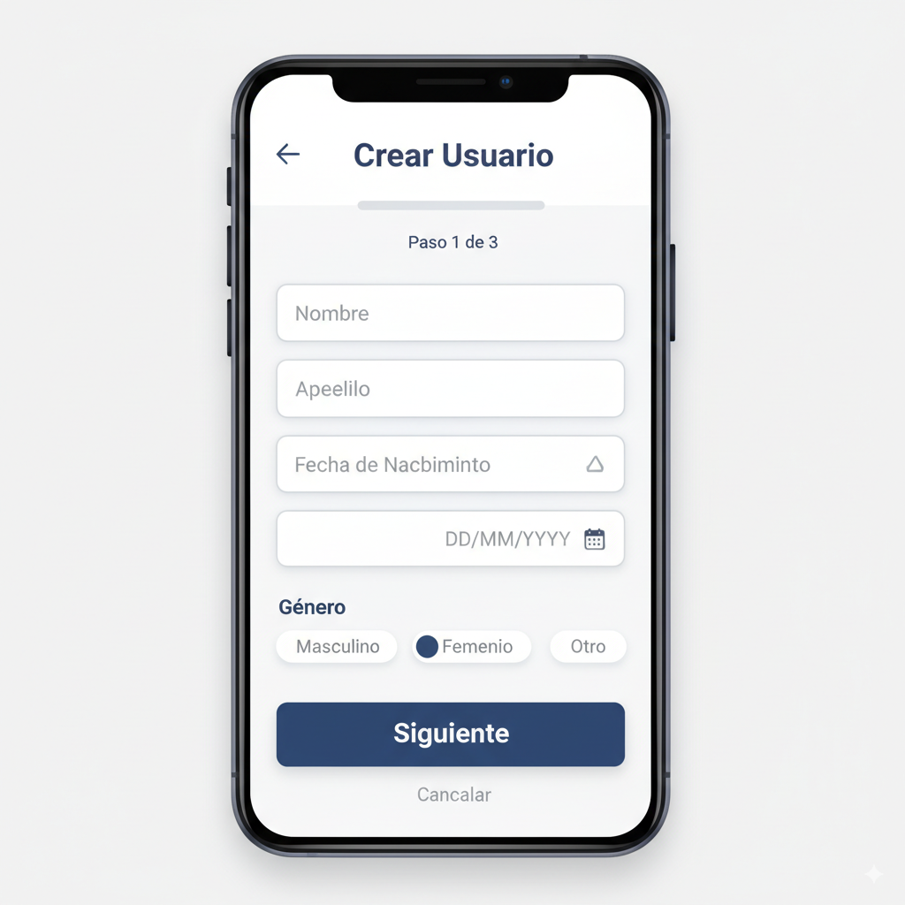
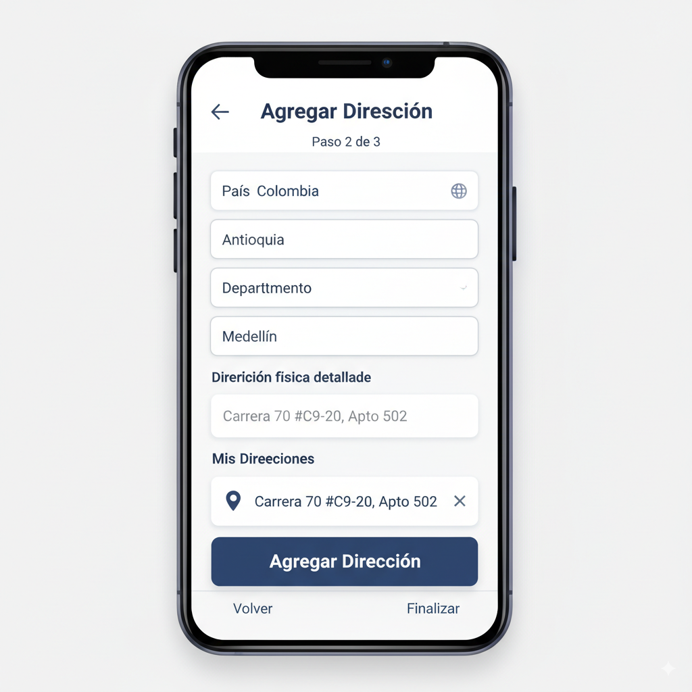

# Proyecto Flutter: Gestión de Usuarios

Este proyecto es una aplicación Flutter que permite crear usuarios, agregar múltiples direcciones y visualizar los datos en un flujo de 3 pantallas, siguiendo buenas prácticas de arquitectura y pruebas unitarias.

## Estructura del Proyecto

```
lib/
  models/         # Modelos de datos (User, Address)
  providers/      # Gestión de estado global (Provider)
  screens/        # Pantallas principales (Crear usuario, Agregar dirección, Detalle usuario)
  widgets/        # Widgets reutilizables (si aplica)
  utils/          # Utilidades y validaciones (si aplica)
  main.dart       # Punto de entrada y configuración de rutas

test/
  models_test.dart  # Pruebas unitarias para modelos
```

## ¿Cómo ejecutar el proyecto?

1. **Clona el repositorio:**
   ```sh
   git clone https://github.com/erneyjonathan23/proyecto_flutter.git
   cd proyecto
   ```
2. **Instala dependencias:**
   ```sh
   flutter pub get
   ```
3. **Ejecuta la app en Linux desktop:**
   ```sh
   flutter run
   ```
   > Si deseas correr en Android o Web, instala Android Studio o Google Chrome y sigue las instrucciones de `flutter doctor`.

4. **Ejecuta los tests unitarios:**
   ```sh
   flutter test
   ```

## Descripción técnica
- Arquitectura basada en Provider para manejo de estado global.
- Separación clara de modelos, lógica y UI.
- Validaciones de formularios y manejo de errores.
- Pruebas unitarias para modelos.
- Cumple principios SOLID y buenas prácticas de Flutter.

## Capturas de Pantalla

Pantalla Crear Usuario:


Pantalla Agregar Dirección:


Pantalla Detalle Usuario:


> Las imágenes deben guardarse en una carpeta `screenshots/` dentro del proyecto para visualizarse correctamente en GitHub.

## Dependencias principales
- flutter
- provider
- flutter_test

